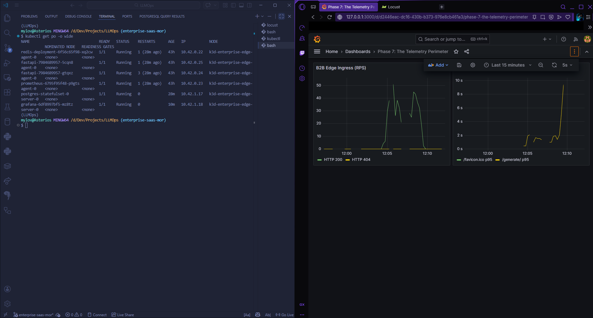

# Enterprise Edge Cluster: Distributed B2B LLMOps (MoR Kubernetes Matrix)

A globally routable, fault-tolerant edge inference node engineered to serve B2B payloads from Ho Chi Minh City to international endpoints without hyperscaler cloud billing. 

This architecture mathematically isolates the trans-continental routing, rate limiting, and financial perimeter from the physical limitations of consumer edge silicon. It utilizes a highly concurrent K3s (Kubernetes) control plane to execute headless inference, ensuring the financial and routing ledgers survive hardware constraints.

## Architectural Matrix

The infrastructure is defined by strict declarative boundaries, scaling from the localized persistent volumes up to the trans-continental Merchant of Record (MoR) webhooks.

### Phase 1: The Headless Matrix (Compute Layer)
Attempting to force multi-billion parameter INT8 tensor allocations through virtualization layers (WSL2/`containerd`) guarantees architectural paralysis (`CrashLoopBackOff`). This matrix abstracts the physical silicon to validate the global routing.
* **The Tactical Lobotomy:** The `bitsandbytes` quantization and Hugging Face tensor allocations have been surgically extracted from the ASGI event loop. 
* **The Syntactical Echo:** The inference engine operates in a headless mode via a lightweight lambda function. This spares the CPU's thermal limits while mathematically proving the high-throughput capabilities of the FastAPI routing matrix.

### Phase 2: The Security Perimeter (State Layer)
Standard localized LLM nodes fracture under concurrent payloads due to in-memory dictionaries. This matrix eradicates localized memory, injecting persistent, decoupled state engines.
* **Cryptographic Authorization (PostgreSQL):** Programmatic B2B access relies on static, long-lived API keys. These keys are validated against a persistent PostgreSQL volume via `asyncpg`, ensuring non-blocking database I/O during the FastAPI lifespan.
* **Atomic Rate Limiting (Redis):** We enforce a localized Redis container executing asynchronous Lua pipelines. This guarantees atomic evaluations of payload frequency, aggressively returning HTTP 429s to hostile actors before the requests penetrate the generation queue.

### Phase 3: The Orchestration Layer (Kubernetes)
The architecture has migrated from fragile Docker Compose networks to a declarative K3d/K3s control plane.
* **The Stateless Swarm:** FastAPI workers are deployed as scaled ReplicaSets, decoupled entirely from the stateful ledgers. 
* **Self-Healing Infrastructure:** Internal DNS is handled strictly via Kubernetes `Service` objects. If a node panics, the API server terminates it and respawns the state instantly.

### Phase 4 & 5: The Abstracted Telemetry Perimeter
A distributed architecture without strict telemetry is an operational black box. This matrix integrates a declarative observability layer to monitor the perimeter defense.
* **The TSDB Scraper:** Prometheus is injected via a Kubernetes `ConfigMap`. It silently scrapes the headless Uvicorn workers every 15 seconds, proving the sub-millisecond latency of the trans-continental routing.
* **Immutable Visualizations:** Grafana is provisioned natively within the cluster. Dashboards (`llmops.json`) and datasources are etched directly into the container state via volume mounts, requiring zero manual UI configuration upon boot.

### Phase 6: The Global MoR Financial Perimeter
Flat-rate billing mathematically guarantees infrastructure ruin under concurrent LLM compute loads. This matrix enforces strict consumption-based token metering via Lemon Squeezy (Merchant of Record).
* **Local Deduction:** The FastAPI router intercepts the generation request, instantly calculating the tokenizer length and deducting the payload from the localized PostgreSQL token balance.
* **Cryptographic Webhooks:** Server-to-server payloads signaling successful MoR invoices are intercepted by `routers/webhook.py`. The payload is verified against a localized symmetric signature (`LEMON_SQUEEZY_WEBHOOK_SECRET`). Authenticated payloads execute an asynchronous `db.commit()` to refill the enterprise client's token ledger.

---

## Deployment Protocol

### 1. Environmental Provisioning
The application expects a strict environment. Secrets must be injected into your Kubernetes manifest or `.env` equivalents. 
*(Note: Ensure your Lemon Squeezy Webhook Secret and JWT algorithm variables are mathematically aligned with your deployment state).*

### 2. The Trans-Continental Cluster Boot
Initialize the K3d matrix and orchestrate the control plane:
```bash
# 1. Compile the Headless Matrix image
docker build -t llmops-enterprise:latest .

# 2. Provision the K3d Cluster
k3d cluster create enterprise-edge -p "8000:80@loadbalancer"

# 3. Inject the production binary
k3d image import llmops-enterprise:latest -c enterprise-edge

# 4. Boot the stateful ledgers and compute swarm
kubectl apply -f k8s/base/state/
```

### 3. The Observability Perimeter



Deploy the declarative telemetry to monitor the routing:
```bash
kubectl apply -f k8s/base/observability/
```
Establish the local port-forwarding bridge to access the visualization matrix:
```bash
kubectl port-forward service/grafana-service 3000:80
```
Navigate to `http://localhost:3000` (Default credentials: admin / admin) to view the Phase 5: Edge Node Telemetry dashboard.

### 4. Synthesizing Trans-Continental Chaos
To mathematically prove the B2B edge ingress resilience locally without relying on external UI logins:

Extract a valid API key from your initialized PostgreSQL ledger:
```bash
kubectl exec -it <postgres-pod-name> -- psql -U admin -d llmops-ledger -c "SELECT valid_api_keys FROM api_key LIMIT 1;"
```
Inflate the ledger balance to absorb the swarm:
```bash
kubectl exec -it <postgres-pod-name> -- psql -U admin -d llmops-ledger -c
"INSERT INTO users (id, username, email, hashed_password, is_active) VALUES (1, 'developer', 'a@gmail.com', 'haha', true);
INSERT INTO api_key (id, user_id, valid_api_keys, is_active, token_balance) VALUES ('<YOUR_API_KEY>', 1, '<YOUR_API_KEY>', true, 10000000);"
```
Inject the key into locustfile.py and ignite the localized swarm, spoofing distributed IP addresses:
```bash
locust -f locustfile.py --host=http://localhost:8000
```
Navigate to `http://localhost:8089`, configure 50 concurrent users with a spawn rate of 5, and initiate the swarm. Observe the Grafana matrix to verify the sub-millisecond financial deduction and stateless routing throughput.